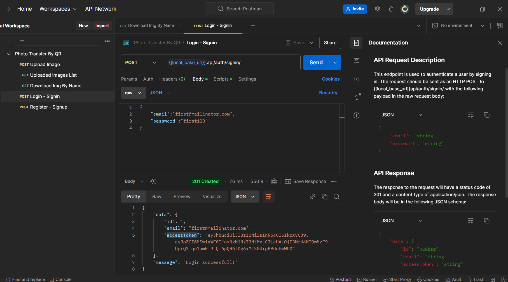

# Photo Transfer Node + MySQL APIs

## Getting Started

This is a [Node.js](https://nodejs.org/en) Backend project with [Express](https://expressjs.com/) and Database MYSQL with [Sequelize](https://sequelize.org/) ORM

## Installation

Download this project as a zip or clone repo:

###### To clone into your system.

- git clone [https://github.com/clubofcodes/photo-transfer-node-mysql-api.git](https://github.com/clubofcodes/photo-transfer-node-mysql-api.git)

```bash
# replace 'proje-dir' with directory name(photo-transfer-node-mysql-api).
cd proje-dir

# To install all node/npm packages listed in package.json file.
npm | pnpm install
```

## Adding Variables to your Environment

Loading your environment variables from a `.env` file is as easy as "ABC"!

#### Create your `.env` file

Create a `.env` file in the root of your project and insert
your key/value pairs in the following format of `KEY=VALUE`:

```sh
DB_HOST=localhost
PORT=8080
DB_USER=YOUR_MYSQL_DB_USERNAME_WITHOUT_QUOTES
DB_PASSWORD=YOUR_MYSQL_DB_PASSWORD_WITHOUT_QUOTES
DB_NAME=YOUR_MYSQL_DATABASE_NAME_WITHOUT_QUOTES
BASE_URL=http://localhost:8080/

```

## To run the project

In the project directory, you can run:

```bash
npm | pnpm run server
```

## For API documentation refer Postman using below Postman collection.

### @[PostMan Collection](./assets/readme/Photo%20Transfer%20By%20QR.postman_collection.json)


